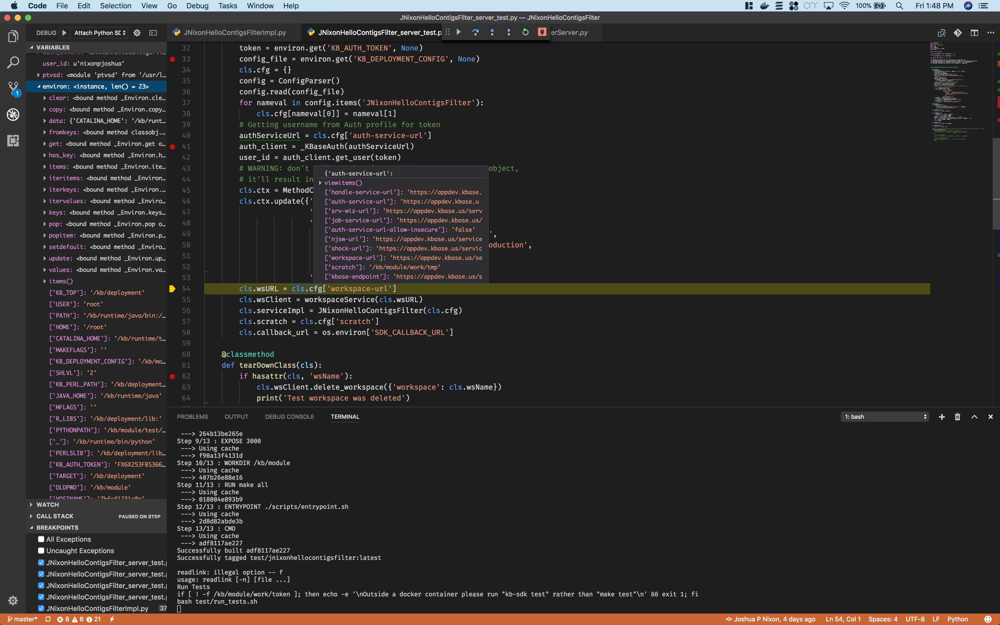

Currently this guide focuses on debugging Python running inside Docker through Visual Studio Code, though some of the methods are generalizable. Further methods for debugging code remotely should be added here with a pull request. With some slight changes this should also work for a truly remote machine or in Visual Studio with PTVS rather than VSCode.

[](https://code.visualstudio.com/)

## Python Debug setup

based on [https://donjayamanne.github.io/pythonVSCodeDocs/docs/debugging_remote-debugging/](https://donjayamanne.github.io/pythonVSCodeDocs/docs/debugging_remote-debugging/)

You wish to debug a Python program (possibly a KBase app) in a visual debugger but that app isn't running on your local machine (possibly inside a docker container on your machine)

### setting the remote machine or Docker container

on your local machine you should install ptvsd 3.0.0 using pip
	pip install ptvsd==3.0.0
(it is important to use version 3.0.0 if using VSCode, newer versions use a different protocol not yet supported)
In Docker configuration can be done by adding these two lines to your Dockerfile:
	RUN pip install ptvsd==3.0.0
    EXPOSE 3000

if not using docker you need to somehow expose a port to your local machine and install ptvsd 3.0.0

### Configuring the code for debugging

In the Python File you wish to debug add
	import ptvsd
as well as code for configuring and attaching the debugger
	ptvsd.enable_attach('mysecret', address=('0.0.0.0', 3000))
    ptvsd.wait_for_attach()
    ptvsd.break_into_debugger()
replace mysecret with whatever you would like to use, here we have used port 3000 for the debugger

### Configuring VSCode
note: this assumes you already have the Python extension by Don Jayamanne installed

edit the launch.json file for your workspace settings

add a new configuration

```json
{
    "name": "Attach to remote Python",
    "type": "python",
    "request": "attach",
    "localRoot": "${workspaceRoot}",
    "remoteRoot": "kb/module",
    "port": 3000,
    "secret": "mysecret",
    "host": "localhost"
}
```


remote root has been set here to be configured for a KBase SDK app, host should be your remote host, set it to localhost if using Docker and link the ports when running your container

### Linking Docker port to localhost

When running docker use the -p flag to link ports. To use port 3000 inside docker with port 3000 on the local machine this means adding -p 3000:3000

If you are trying to debug a KBase SDK app and want to run using kb-sdk test you will have to edit the run_tests.sh file inside of the test_local directory and add the -p flag. It should end up looking something like this
``` Bash
#!/bin/bash
script_dir="$(cd "$(dirname "$(readlink -f "$0")")" && pwd)"
cd $script_dir/..
$script_dir/run_docker.sh run -v $script_dir/workdir:/kb/module/work -p 3000:3000 -e "SDK_CALLBACK_URL=$1" test/myappname:latest test
```

### Debugging in VSCode

1. First run the app remotely or inside Docker (kb-sdk test)
2. Wait for the execution of your remote enviorment to break where you inserted the debug Python Code
3. Hit the play button in the debug section of VScode with the debug configuration you created ealier in the launch.json (It will have the same name)
4. Happy debugging 😜